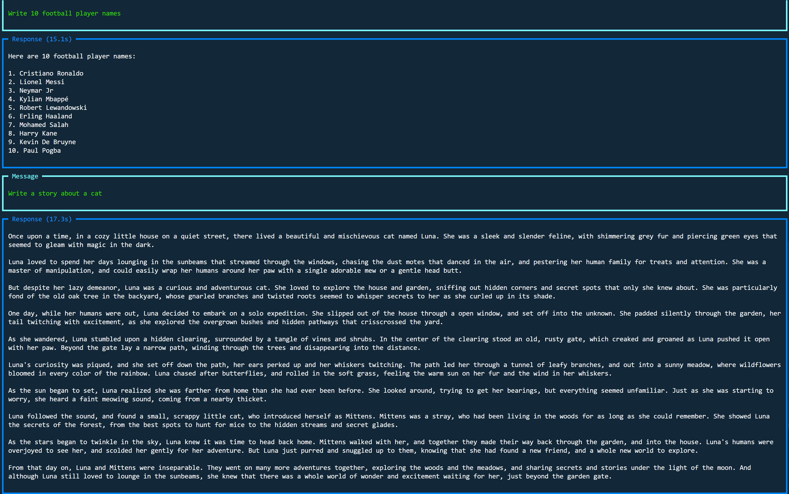
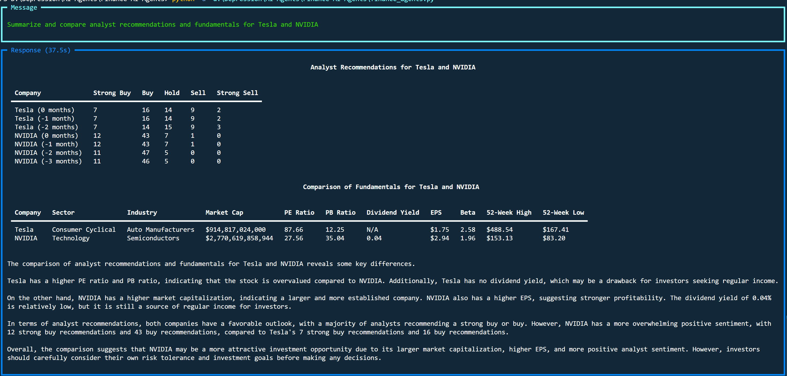
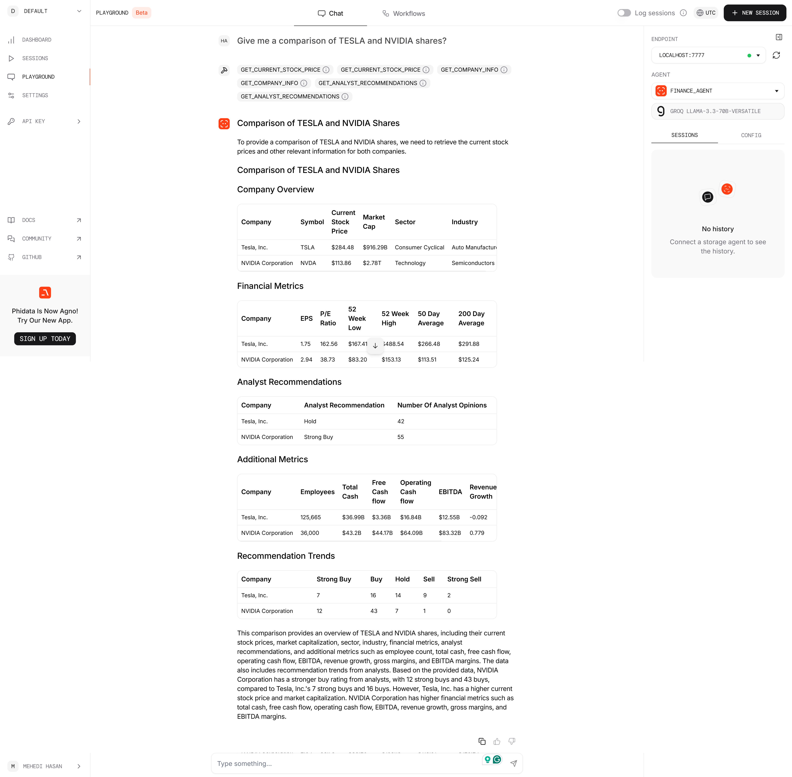

# 💼 Finance AI Agents

A powerful suite of AI agents tailored to streamline and enhance financial workflows—ranging from budgeting and forecasting to investment analysis and intelligent insights. Built using state-of-the-art language models and financial algorithms.

---

## 🚀 Features

- 📊 **Budgeting Assistant** – Helps track, categorize, and plan financial budgets.
- 📈 **Forecasting Models** – Predicts future trends in revenue, expenses, and investments.
- 💡 **Investment Analysis** – Offers AI-powered stock and portfolio insights.
- 🤖 **Groq-Powered Agents** – Leverages the Groq API for ultra-fast inference.
- 🧠 **Phi Data Integration** – Chat with your agents using Phi Data-powered tools.
- 🧪 **Interactive Playground** – Test agents in an experimental playground environment.

---

## 📚 Resources

- [📘 Phi Data Documentation](https://docs.phidata.com/introduction)

---

## 🛠️ Installation

1. **Clone the repository**
    ```bash
    git clone https://github.com/yourusername/finance-ai-agents.git
    cd finance-ai-agents
    ```

2. **Install dependencies**
    ```bash
    pip install -r requirements.txt
    ```

3. **Set up environment variables**
    - Create a `.env` file in the root directory.
    - Add your API keys and any required configuration, e.g.:
      ```
      GROQ_API_KEY=your_api_key_here
      PHI_DATA_API_KEY=your_phi_key_here
      ```

---

## ⚙️ Usage

Run individual modules directly from the command line:

- **Finance Agents**
  ```bash
  python finance_agents.py
  ```

- **Team Agents**
  ```bash
  python agents_team.py
  ```

- **Playground Interface**
  ```bash
  python playground.py
  ```

---

## 📸 Screenshots

### ✅ Groq API Testing


### 📊 Finance Agents Output


### 💬 Phi Data Chat Playground


---

## 🤝 Contributing

We welcome contributions! Follow these steps:

1. Fork this repository.
2. Create a new branch:
    ```bash
    git checkout -b feature/your-feature-name
    ```
3. Make and commit your changes:
    ```bash
    git commit -m "Add: your-feature-name"
    ```
4. Push your branch:
    ```bash
    git push origin feature/your-feature-name
    ```
5. Submit a pull request.

---

## 📄 License

This project is licensed under the [MIT License](LICENSE).

---

## 📬 Contact

For feedback or collaboration inquiries, reach out via [LinkedIn](https://www.linkedin.com/in/thereds13/).
